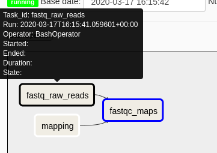
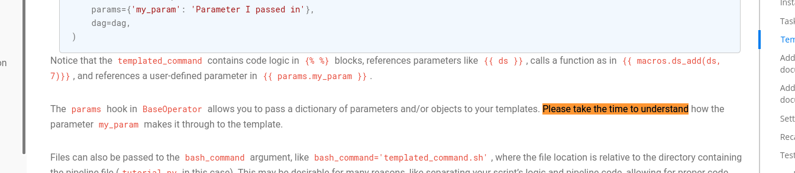

# Example Bioinformatics Project
Compare and contrast available tools for bioinformatics projects

## Workflow tools
May be based on [this](https://github.com/grst/snakemake_nextflow_wdl).

There are [many tools](https://github.com/common-workflow-language/common-workflow-language/wiki/Existing-Workflow-systems) for bioinformaticians to choose from. Each tool comes with its own trade-offs,
features, hurdles. Prior work in this area includes [an informal survey or popularity](https://docs.google.com/forms/d/e/1FAIpQLScoj8Po4P3Qrh7rbJrq2R35c3PQsNCynEeEVUAdcGyly7TT_Q/viewanalytics),
and the following review articles:
1. Jeremy Leipzig, A review of bioinformatic pipeline frameworks, Briefings in Bioinformatics, Volume 18, Issue 3, May 2017, Pages 530–536, https://doi.org/10.1093/bib/bbw020
2. Elise Larsonneur et al. Evaluating Workflow Management Systems: A Bioinformatics Use Case, published in 2018 IEEE BIBM, https://doi.org/10.1109/BIBM.2018.8621141

| Tool                                              | Result Summary                        | Documentation                                          | Programming Language                         | Tool Usability | Docker?            | GUI?               | HPC?               |
|---------------------------------------------------| --------------------------------------|--------------------------------------------------------|----------------------------------------------|----------------|--------------------|--------------------|--------------------|
| [GNU Make](https://www.gnu.org/software/make/)    | :heavy_check_mark:                    | [Excellent](https://www.gnu.org/software/make/manual/) | Shell                                        | Difficult      | :x:                | :x:                | :x:                |
| [SnakeMake](https://snakemake.readthedocs.io)     | :heavy_check_mark::construction:                        | [Excellent](https://snakemake.readthedocs.io)                  | Python                                       | Relatively easy              | :heavy_check_mark:    | :x:      | :heavy_check_mark:      |
| [Nextflow](https://www.nextflow.io/)              | :heavy_check_mark:                    | [Excellent](https://www.nextflow.io/docs/latest/index.html)    | Groovy                                            | Intermediate              | :heavy_check_mark:        | :x:         | :heavy_check_mark: |
| [Guix Workflow Language](https://www.guixwl.org/) | :x:                                   | [Seems good](https://www.guixwl.org/manual/)           | [Guile Scheme](https://www.gnu.org/s/guile/) | N/A            | :heavy_check_mark: | :x:                | :heavy_check_mark: |
| [Apache Airflow](https://airflow.apache.org/)     | :x:                                   | [Poor](https://airflow.apache.org/docs/stable/)        | Python                                       | Difficult      | :heavy_check_mark: | :heavy_check_mark: | :heavy_check_mark: |
| [Toil](https://toil.ucsc-cgl.org/)                |
| [Cromwell/WDL](https://cromwell.readthedocs.io)   |
| [CWL](https://www.commonwl.org/)                  |
| [Ruffus](http://www.ruffus.org.uk/)               |
| [Apache Taverna](https://taverna.apache.org/)     |
| [Cuneiform](https://cuneiform-lang.org/)          |
| [Knime](https://www.knime.com/knime)              |
| [Galaxy](https://usegalaxy.org/)                  | :heavy_check_mark: | [Usable](https://galaxyproject.org/learn/) | Visual DAG | Easy - Intermediate | :no_entry_sign: | :heavy_check_mark: | :no_entry_sign: |
| [BioShake](https://github.com/PapenfussLab/bioshake)|


Key:

:heavy_check_mark: :heavy_check_mark: - recommended

:heavy_check_mark: - usable

:x: - not (yet) useful / usable

:no_entry_sign: - not applicable (see detailed entry)

:construction: - evaluation in progress

## Situation 1
We presume the data & reference have already been downloaded, if not, download it similarly as explained in [this repo](https://github.com/tmuylder/variantcalling/blob/master/Commands_jan2020_10pc.md). The commands that should be used are listed here below.

Respect the following file structure:
```
 project-folder/
    |
    |- data/
    |   |- HG001.GRCh38_chr22_0.01.fq.gz
    |   |- ...
    |
    |- reference/
    |   |- ...
    |
    |- nextflow/ 
    |   |- ...
    |
    |- snakemake/
    |   |-...
    | 
    ...
```

## Setup
A conda environment can be set up with
```bash
conda env create -n workflow -f environment.yml
conda activate workflow
```

## Commands

```
# Make directory quality-controls & perform fastqc
mkdir test-commands/quality-control
fastqc --outdir test-commands/quality-control/ data/HG001.GRCh38_chr22_0.01_1.fq.gz data/HG001.GRCh38_chr22_0.01_2.fq.gz

# Make directory bwa-mappings & perform alignment & convert sam to bam
mkdir test-commands/bwa-mapping
bwa mem -t 4 -M reference/Homo_sapiens_assembly38_chr22.fa data/HG001.GRCh38_chr22_0.01_1.fq.gz data/HG001.GRCh38_chr22_0.01_2.fq.gz | samtools view -b - -o test-commands/bwa-mapping/HG001_chr22_rawmappings.bam

# Quality control on bam file
fastqc --outdir test-commands/quality-control/ test-commands/bwa-mapping/HG001_chr22_rawmappings.bam
```
## Evaluation and Experiences
### GUIX Workflow Language
This tool is very new. Based on GUIX which is very promising for reproducability (minimal system bootstrap).
The language is based on high-level definitions of "processes" and "workflows".
It is a DSL for scheme so a user could drop into a powerful general-purpose programming language if they need to.

The simple sample workflow from the documentation looks like this:
```
process greet
  packages "hello"
  # { hello }

process sleep
  packages "coreutils"
  # {
    echo "Sleeping..."
    sleep 10
  }

process eat (with something)
  name
    string-append "eat-" something
  # {
    echo "Eating {{something}}"
  }

process bye
  # { echo "Farewell, world!" }

workflow simple-wisp
  processes
    let
      :
        eat-fruit : eat "fruit"
        eat-veges : eat "vegetables"
      graph
        eat-fruit -> greet
        eat-veges -> greet
        sleep     -> eat-fruit eat-veges
        bye       -> sleep
```

I could install gwl, but the documented `guix workflow` command does not exist after installation.
It just had a `0.2.1` bugfix release which does not appear to fix this issue.
In summary, it is not ready to use _yet_.
The [manual](https://www.guixwl.org/manual/gwl.html) seems fairly comprehensive but this has, of course, not been tried in anger.

### GNU Make
This tool is _very_ old and also very common on GNU/Linux systems (users may not even need to install it).
The workflow is expressed as a tree of dependency relationships between files.
Independent trees may be executed in parallel.
Make will not re-run tasks that _do not need to be re-run_ where this is defined by the timestamp on the
output relative to the input. These relationships are defined like this:
```make
target: input
 recipe
multiple targets: several dependencies
 recipe $^ > $@ # Generate a single target
many outputs &:: that are all
 generated at once by this recipe
.PHONY: just-a-name
just-a-name:
 recipe
```
[Documentation](https://www.gnu.org/software/make/manual/html_node/index.html) is good and comprehensive though lacking in examples. Though this is generally made up for because `make` is used so foten. A quick internet search will reveal many potential answers, unfortunately some of which are well out of date. That being said, `make` doesn't change very much. There are 2 main downsides to expressing workflows in `make` (besides the modern features that other, more special purpose tools have) are the arcane syntax and the difficult-to-reason-about semantics of dependency trees described manually. For software, `Makefile`s are usually automatically generated.

### Nextflow
Nextflow is on the way to be the reference bioinformatics pipeline tool. The scripting language is Groovy which makes it in my opinion daunting at first, however with some time spent reading the [manual](https://www.nextflow.io/docs/latest/getstarted.html) it becomes more comprehensible. Together with a very troublesome error-reporting, these are Nextflow's main drawbacks. It has many strengths on the other side: 
- Easy installation and running
- Use of conda en containers for environment with all necessary tools, so not caring about any tools that need to be installed (+ reproducibility). 
- Pipeline resumes after it breaks down at a specific point
- Theoretically: parallelization,  scalability

Script so far is [here](scripts/testmapping.nf)

IMO: I think there is a lack on specific bioinformatics related tutorials although it is used specifically for this purpose. E.g.: according to the manual, `set` is deprecated in the current version (hence no more documentation on how to use it) and has been replaced by `tuple`, however all of the pipelines out there use `set`. `tuples` should be generated from channels with read pairs, however it's continuously getting stuck somewhere and it's close to impossible to find out where the error is exactly. 

### Snakemake
Snakemake is a Python-based workflow management system making it an easy human readable pipeline tool. It contains the same way of working as Make, which is the predecessor of Snakemake. Make looks for a file named `Makefile` when running the `make` command which specifies the rules describing the steps that are run. It consists of a **target** (output), single or list of **dependencies** (input) and the **commands** (Unix commands). Whereas Snakemake looks for a file named `Snakefile` when running the `snakemake` command. The `Snakefile` has rules defining each process and a rule consists of inputs, outputs and commands, just like the `Makefile` has. 

Each rule has a name, filenames and commands are always quoted, shell commands are explicitly defined within a `shell` block whereas Python code is defined in a `run` block. 

Installing Snakemake is easily done with `Conda`, in this case the environment is defined in the `environment-snakemake.yml`-file. When running `snakemake` it searches by default in the same directory for a file `Snakefile`, or you'll have to specify it explicitly. Often you'll perform a `--dry-run` that gives you a sneak peek in how snakemake will run. The output has been summarized here below. Tons of other parameters can be defined to tailor the running of your pipeline to your needs.   

```
Job counts:
        count   jobs
        1       all
        1       bwa_mapping
        1       fastqc_mapped
        1       fastqc_raw
        4
This was a dry-run (flag -n). The order of jobs does not reflect the order of execution.
```

Now, in one of the simplest examples, running fastqc would look like this. 
```python
rule fastqc_raw:
    """
    Fastqc of raw-reads. 
    """
    input:
        "/path/to/data/read_1.fq",
         "/path/to/data/read_2.fq"
    output:
        directory("/path/to/snakemake/quality-control")
    shell:
        """
        mkdir -p {output}
        fastqc --outdir {output} {input[0]} {input[1]}
        """
``` 
In this case, I've defined an output (which I also put in `rule all`) because of the way that Snakemake works in its core: you're defining the output file and it will backtrack through all the processes with which files it needs to start to create this output. If you don't define something like a fastqc in the output it's a dead end and will not be processed.  

Note that you thus have to define one rule that rules them all:
```python
rule all:
    input:
        "/path/to/raw_mappings.bam",
        directory("/path/to/quality-control"),
        directory("/path/to/quality-control-mapped")
```

**Flexibility** in the rule-arguments (interesting for future work):
- Defining inputs: expanding, wildcards, references etc.
- Threads
- Messages
- Priorities
- Log-files
- Job properties
- Dynamic files
- Config files

References: 
- https://github.com/maxplanck-ie/snakepipes/tree/2.0.0
- https://vincebuffalo.com/blog/2020/03/04/understanding-snakemake.html
- https://github.com/vanheeringen-lab/snakemake-workflows

### Apache Airflow
Airflow is a general purpose pipelining tool intended to be set up by an expert once for an organisation
and run workflows on a schedule. Workflows are expected to not change very often. There is a nice web interface which is able
to display workflows as a graph, shows progress and scheduling information, though it does not aloow for editing workflows.



The initial setup is very complex -- I never managed to run a workflow from the web interface.
Feels verbose and "enterprisy".


Workflows are defined as Python scripts -- actually configuration files. The actual work can be done in Python, bash, etc.
Documentation is severly lacking -- frastratingly not quite what one is looking for in many cases.
For example, the tutorial states, "Please take the time to understand **<concept>**" but does not provide _any_ pointers to documentation for that concept.


